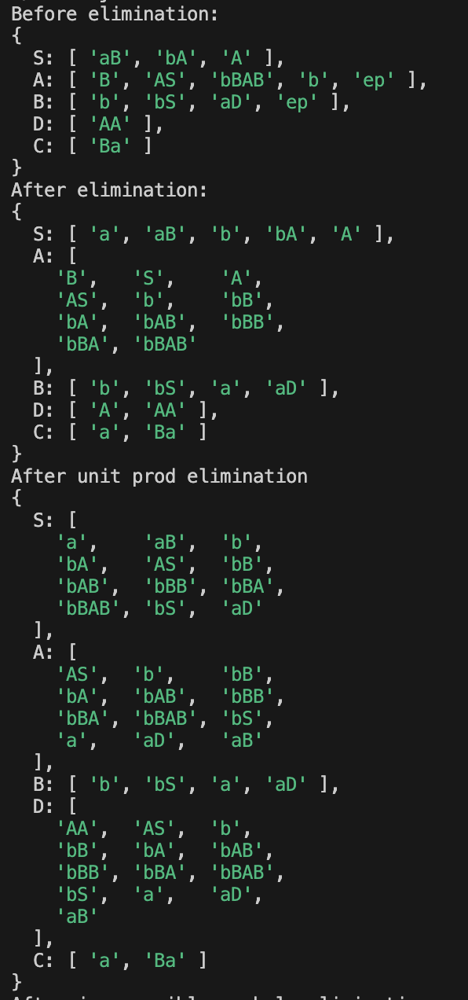
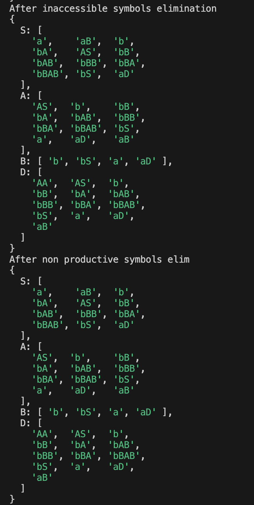
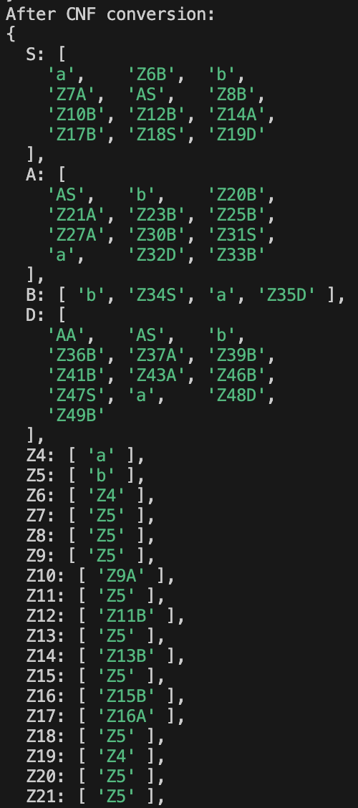

# Chomsky Normal Form

### Course: Formal Languages & Finite Automata

### Author: Maria Colța

---

## Theory

In formal language theory, a context-free grammar (CFG), `G`, is said to be in **Chomsky Normal Form** (first described by Noam Chomsky) if all of its production rules conform to one of the following formats:

1. `A → BC`
2. `A → a`
3. `S → ε`

Where:

- `A`, `B`, and `C` are nonterminal symbols.
- `a` represents a terminal symbol, which is a symbol that represents a constant value.
- `S` is the start symbol.
- `ε` denotes the empty string.

### Conditions:

- Neither `B` nor `C` may be the start symbol.
- The third production rule (`S → ε`) can only appear if `ε` is in `L(G)`, the language produced by the context-free grammar `G`.

### Properties:

- Every grammar in Chomsky Normal Form is context-free.
- Every context-free grammar can be transformed into an equivalent one in Chomsky Normal Form. The size of the transformed grammar will be no larger than the square of the original grammar's size.

### Conversion from CFG to CNF

To convert a context-free grammar (CFG) to Chomsky Normal Form (CNF), follow these simplified steps:

- **Eliminate ε-productions:**

  - Remove rules that produce the empty string, except for the start symbol.

- **Remove Unit Productions:**

  - Eliminate rules where a nonterminal leads directly to another nonterminal.

- **Eliminate Useless Symbols:**

  - Remove nonterminals that don't generate terminal strings or are unreachable.

- **Standardize Productions:**

  - Convert all rules to the forms `A → BC` or `A → a`, using intermediate nonterminals if necessary.

- **Modify Start Symbol:**
  - Introduce a new start symbol if the original appears on the right side of any rule.

## Objectives:

- Learn about Chomsky Normal Form (CNF)
- Get familiar with the approaches of normalizing a grammar..
- Implement a method for normalizing an input grammar by the rules of CNF.

  - The implementation needs to be encapsulated in a method with an appropriate signature (also ideally in an appropriate class/type).

  - The implemented functionality needs executed and tested.

  - A BONUS point will be given for the student who will have unit tests that validate the functionality of the project.

  - Also, another BONUS point would be given if the student will make the aforementioned function to accept any grammar, not only the one from the student's variant.

## Implementation description

## Grammar Class Implementation

This JavaScript class provides methods for converting any context-free grammar (CFG) into Chomsky Normal Form (CNF). Below are the main components and methods of the `Grammar` class:

### Constructor

- **Parameters**: `nonTerminals` (array of non-terminal symbols), `terminals` (array of terminal symbols), `productions` (object mapping non-terminals to an array of their productions).
- **Purpose**: Initializes a new instance of the grammar with the specified non-terminals, terminals, and productions.

### Methods

#### `eliminateEpsilon()`

- **Purpose**: Removes ε-productions (productions that generate an empty string) from the grammar. It first identifies non-terminals that produce ε directly or indirectly and then modifies the productions to eliminate ε while preserving the language generated by the grammar.

#### `removeUnitProductions()`

- **Purpose**: Eliminates unit productions (productions where a non-terminal leads directly to another non-terminal) by replacing them with the appropriate productions of the non-terminals they point to.

#### `removeInaccessibleSymbols()`

- **Purpose**: Removes non-terminal symbols that are not accessible from the start symbol. This helps in reducing the size of the grammar and focusing only on the usable parts.

#### `removeNonProductiveSymbols()`

- **Purpose**: Identifies and removes non-terminals that do not produce any terminal strings, making the grammar more efficient and manageable.

#### `convertToCNF()`

- **Steps Involved**:
  1. Calls `eliminateEpsilon()` to handle ε-productions.
  2. Uses `removeUnitProductions()` to deal with unit productions.
  3. Applies `removeInaccessibleSymbols()` to discard inaccessible symbols.
  4. Executes `removeNonProductiveSymbols()` to eliminate non-productive symbols.
  5. Ensures all productions are in the form `A → BC` or `A → a` by introducing intermediate non-terminals as necessary.

### Usage

Instantiate the class with the required grammar components and call `convertToCNF()` to transform the grammar into Chomsky Normal Form. This method modifies the grammar in-place.

### Example

```javascript
let nonTerminals = ["S", "A", "B"];
let terminals = ["a", "b"];
let productions = {
  S: ["AB", "BC"],
  A: ["a", "S"],
  B: ["b", "ep"],
};

let grammar = new Grammar(nonTerminals, terminals, productions);
grammar.convertToCNF();
console.log(grammar.productions);
```

## Results

For the first task, I had the following variant:

```

Variant 4:
VN={S, A, B, C, D},
VT={a, b},
P={
    S → aB
    S → bA
    S → A
    A → B
    A → AS
    A → bBAB
    A → b
    B → b
    B → bS
    B → aD
    B → ep
    D → AA
    C → Ba
}

```

After running the code, I got the following result:




