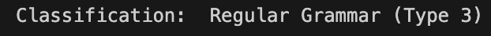
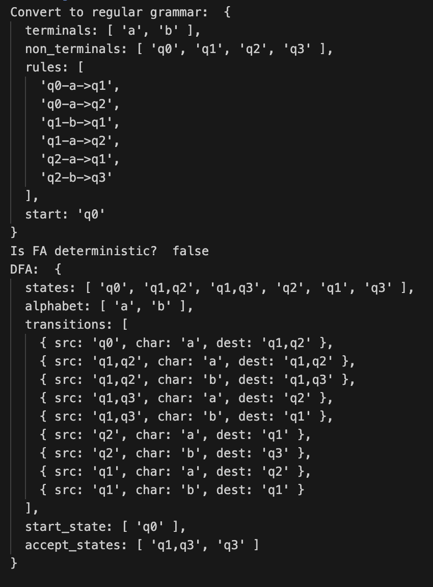

# Determinism in Finite Automata. Conversion from NDFA 2 DFA. Chomsky Hierarchy.

### Course: Formal Languages & Finite Automata

### Author: Maria Colța

---

## Theory

The **Chomsky hierarchy** is a fundamental framework in the field of theoretical computer science and linguistics, introduced by Noam Chomsky in 1956. It classifies formal grammars into four distinct levels according to their generative power, essentially categorizing different types of languages and automata (computational models) that recognize these languages.

- At the bottom of the hierarchy is **Type 3**, or regular grammars, which are recognized by finite automata and correspond to regular languages. These are the simplest and least powerful grammars.
- Moving up, **Type 2** consists of context-free grammars, recognized by pushdown automata, which generate context-free languages used in the analysis of programming languages.
- **Type 1** or context-sensitive grammars, are more complex and are recognized by linear-bounded automata; they generate context-sensitive languages that can describe some natural language constructs not possible with Type 2.
- At the top of the hierarchy is **Type 0**, which includes recursively enumerable grammars recognized by Turing machines. This level is the most powerful, capable of expressing any computation that can be performed by a computer.

**Non-deterministic Finite Automata (NFAs)** and **Deterministic Finite Automata (DFAs)** are key concepts in automata theory, used for recognizing patterns and regular languages. The main distinction lies in their state transitions: DFAs have exactly one transition per state and input symbol, ensuring a single computational path, while NFAs can transition to multiple states for the same input, allowing for various paths simultaneously, including ε-transitions that require no input. Despite these operational differences, both NFAs and DFAs are equally powerful in terms of language recognition, although NFAs can often represent languages more succinctly.

**NFA: Non-deterministic Finite Automata**

- Multiple Transitions: Can transition to several states from a single input, including without consuming an input (ε-transitions).
- Parallel Paths: Capable of exploring multiple paths or states simultaneously.
- Conversion to DFA: Possible but may lead to an exponential increase in states.

**NDFA: Deterministic Finite Automata**

- Single Transition: One transition per state and input symbol, leading to predictability.
- Simplicity in Analysis: Easier to analyze and implement due to deterministic nature.
- State Efficiency: Potentially more states required than an equivalent NFA for some languages.

## Objectives:

- Understand what an automaton is and what it can be used for.
- Continuing the work in the same repository and the same project, the following need to be added: a. Provide a function in your grammar type/class that could classify the grammar based on Chomsky hierarchy.
  - For this you can use the variant from the previous lab.
- According to your variant number (by universal convention it is register ID), get the finite automaton definition and do the following tasks:

  - Implement conversion of a finite automaton to a regular grammar.

  - Determine whether your FA is deterministic or non-deterministic.

  - Implement some functionality that would convert an NDFA to a DFA.

  - Represent the finite automaton graphically (Optional, and can be considered as a bonus point):

  - You can use external libraries, tools or APIs to generate the figures/diagrams.

  - Your program needs to gather and send the data about the automaton and the lib/tool/API return the visual representation.

## Implementation description

For the first task, I used the code from the previous laboratory in Regular Grammar. In the `Grammar` class, I added the `classify` method which classifies the grammar based on Chomsky hierarchy:

```
classify() {
    let isType3 = true;
    let isType2 = true;
    let isType1 = true;

    this.rules.forEach((rule) => {
      const [leftSide, rightSide] = rule.split("-");
      const rightSideSymbols = rightSide.split("");
      const terminalSymbols = rightSideSymbols.filter((symbol) =>
        this.terminals.includes(symbol)
      );
      const nonTerminalSymbols = rightSideSymbols.filter((symbol) =>
        this.non_terminals.includes(symbol)
      );

      if (
        !(
          (
            (terminalSymbols.length === 1 && nonTerminalSymbols.length <= 1) || // A -> aB or A -> a
            rightSide === "$"
          )
        )
      ) {
        isType3 = false;
      }

      if (
        leftSide.length !== 1 ||
        this.non_terminals.indexOf(leftSide) === -1
      ) {
        isType2 = false;
      }

      if (rightSide.length < leftSide.length) {
        isType1 = false;
      }
    });

    if (isType3) {
      return "Regular Grammar (Type 3)";
    } else if (isType2) {
      return "Context-Free Grammar (Type 2)";
    } else if (isType1) {
      return "Context-Sensitive Grammar (Type 1)";
    } else {
      return "Recursively Enumerable Grammar (Type 0)";
    }
  }
```

This code snippet is designed to classify grammars into one of four categories based on the Chomsky hierarchy: _Regular Grammar (Type 3)_, _Context-Free Grammar (Type 2)_, _Context-Sensitive Grammar (Type 1)_, or _Recursively Enumerable Grammar (Type 0)_. It achieves this by examining each production rule of a given grammar. The classification is determined by specific conditions:

- **Type 3 (Regular Grammar)**: A rule must transform a non-terminal into a single terminal followed by at most one non-terminal (A -> aB or A -> a) or into the empty string ($). If any rule doesn't meet this criteria, the grammar is not Type 3.
- **Type 2 (Context-Free Grammar)**: Each rule's left side must consist of a single non-terminal. If a rule has more than one symbol or includes a terminal on the left side, the grammar cannot be Type 2.
- **Type 1 (Context-Sensitive Grammar)**: The length of the rule's right side must not be shorter than the left side. This ensures the grammar can handle contexts sensitively.
- **Type 0 (Recursively Enumerable Grammar)**: If a grammar does not fit into any of the above types, it falls into this most general category.
  The code iteratively checks each rule against these conditions, adjusting the classification flags (isType3, isType2, isType1) accordingly. The final classification is returned based on which conditions are met, moving from the most specific (Type 3) to the most general (Type 0).

For the next tasks, I was given the following finite automaton definition:

```
Variant 4
Q = {q0,q1,q2,q3},
∑ = {a,b},
F = {q3},
δ(q0,a) = q1,
δ(q0,a) = q2,
δ(q1,b) = q1,
δ(q1,a) = q2,
δ(q2,a) = q1,
δ(q2,b) = q3.
```

I implemented the `FiniteAutomaton`class.

The given automaton was encapsulated within the `FiniteAutomaton` class, which is responsible for converting the automaton to regular grammar, also it checks whether the finite automaton is deterministic or not, and if it is non-deterministic, there is a method that can be used to transform it to deterministic finite automaton. Here is the class definition:

```
class FiniteAutomaton {
  constructor() {
    this.states = ["q0", "q1", "q2", "q3"];
    this.alphabet = ["a", "b"];
    this.transitions = [
      { src: "q0", char: "a", dest: "q1" },
      { src: "q0", char: "a", dest: "q2" },
      { src: "q1", char: "b", dest: "q1" },
      { src: "q1", char: "a", dest: "q2" },
      { src: "q2", char: "a", dest: "q1" },
      { src: "q2", char: "b", dest: "q3" },
    ];
    this.start_state = "q0";
    this.accept_state = "q3";
  }
...
}
```

Next I implemented the `to_regular_grammar` method:

```
  to_regular_grammar() {
    let grammar = {
      terminals: [],
      non_terminals: [],
      rules: [],
      start: "",
    };

    this.alphabet.forEach((char) => {
      grammar.terminals.push(char);
    });

    this.states.forEach((state) => {
      grammar.non_terminals.push(state);
    });

    this.transitions.forEach((state) => {
      grammar.rules.push(`${state.src}-${state.char}->${state.dest}`);
    });

    grammar.start = this.start_state;

    return grammar;
  }

```

It transforms a finite automaton into a regular grammar by creating a `grammar` object with lists for terminals, non_terminals, and rules, and a start symbol. It fills the terminals with the automaton's alphabet and the non_terminals with its states. For each transition in the automaton, it adds a rule formatted as `sourceState-character->destinationState` to the rules list. The automaton's start state is assigned as the grammar's start symbol. This method returns the constructed regular grammar, mapping the automaton's transitions into grammar rules.

Also in the `FiniteAutomaton` class I defined the `is_deterministic` method, which checks if the finite automaton is an NFA or DFA:

```
  is_deterministic() {
    const transitionMap = {};

    for (let { src, char, dest } of this.transitions) {
      if (!transitionMap[src]) {
        transitionMap[src] = {};
      }

      if (!transitionMap[src][char]) {
        transitionMap[src][char] = new Set();
      }
      transitionMap[src][char].add(dest);

      if (transitionMap[src][char].size > 1) {
        return false;
      }
    }
    return true;
  }
```

It creates a map to track transitions from each source state based on input characters. For each transition, it adds the destination state to a set associated with the source state and character. If, for any source state and character, there's more than one destination state (indicating the set's size is greater than 1), the automaton is deemed non-deterministic, and the method immediately returns false. If the method completes without finding any such condition, it concludes the automaton is deterministic and returns true. This approach ensures that for each state and input, there is at most one possible transition, a hallmark of deterministic automata.

And the final method is this class is `to_dfa':

```
to_dfa() {
    const dfa = {
      states: [],
      alphabet: [...this.alphabet],
      transitions: [],
      start_state: [this.start_state],
      accept_states: [],
    };

    const stateMap = {};

    const queue = [[...dfa.start_state].sort()];

    stateMap[queue[0].join(",")] = queue[0].join(",");

    while (queue.length > 0) {
      const currentState = queue.shift();
      const currentStateId = currentState.join(",");

      if (!dfa.states.includes(currentStateId)) {
        dfa.states.push(currentStateId);
      }

      if (
        currentState.some((state) => this.accept_state === state) &&
        !dfa.accept_states.includes(currentStateId)
      ) {
        dfa.accept_states.push(currentStateId);
      }

      this.alphabet.forEach((char) => {
        const nextState = new Set();

        currentState.forEach((state) => {
          this.transitions.forEach((transition) => {
            if (transition.src === state && transition.char === char) {
              nextState.add(transition.dest);
            }
          });
        });

        const nextStateArray = Array.from(nextState).sort();
        const nextStateId = nextStateArray.join(",");

        if (nextState.size > 0) {
          if (!stateMap[nextStateId]) {
            stateMap[nextStateId] = nextStateId;
            queue.push(nextStateArray);
          }

          dfa.transitions.push({
            src: currentStateId,
            char: char,
            dest: nextStateId,
          });
        }
      });
    }

    return dfa;
  }
```

The `to_dfa` method transforms a non-deterministic finite automaton (NFA) into a deterministic finite automaton (DFA) by systematically exploring all possible transitions for each state and input symbol. It initializes a DFA with the NFA's alphabet, an empty set of states, and transitions, then processes each state combination to identify unique DFA states and transitions based on the NFA's behavior. It tracks processed and new state combinations using a queue and a state map, ensuring each composite state is explored exactly once. The method aggregates transitions from the NFA to form deterministic transitions in the DFA, adding new states as combinations of NFA states when necessary. Accept states in the DFA are determined by checking if any constituent NFA state is an accept state. The result is a DFA that accurately represents the original NFA's language.

## Results

For the first task, I checked the grammar I had for the previous laboratory work:

```
Variant 4:
VN={S, L, D},
VT={a, b, c, d, e, f, j},
P={
    S → aS
    S → bS
    S → cD
    S → dL
    S → e
    L → eL
    L → fL
    L → jD
    L → e
    D → eD
    D → d
}
```

To determine the type of the grammar, I used the `classify` method described above. Here is the result:


After running the methods from `FiniteAutomaton` class, we get the following result:


In the beginning we have the grammar resulted after conversion from Finite Automaton. Next we determine if the FA is determinisitc or not. In our case, it is NFA. Therefore, we have the DFA that we can get from this specific NFA.
