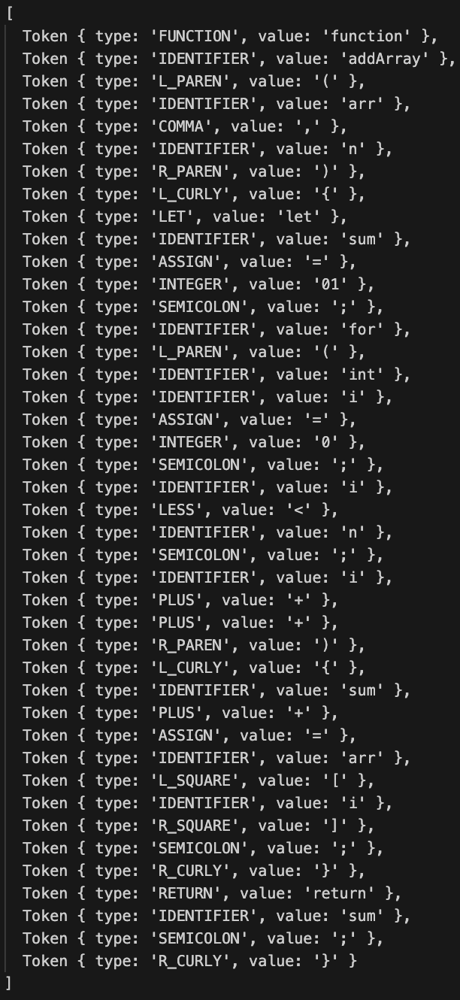

# Lexer & Scanner

### Course: Formal Languages & Finite Automata

### Author: Maria Colța

## Theory

**Lexical analysis** is the interpretation or compilation that tries to find the structure of the input text of a program in the form of a stream of tokens and programming languages. They are, in fact, atomic pieces of syntax: keywords, identifiers, literals (like numbers or strings), and operators. The matching of the patterns in the input text with those tokens is done by a lexical analyzer, or lexer. It is somewhat disassembling a sequence of characters into meaningful symbols according to the rules of a programming language.

Lexical analysis is basically carried out to make the parser's work, which is the next stage in a compiler's compilation or interpretation workflow, much easier. The lexer abstracts away from the details of the format of the text—for example, whitespace and comments, which are normally of no interest to the syntactic structure of the program—by translating the raw input text into a stream of tokens. This abstraction enables the parser to concentrate on the syntactic analysis, without being confused by the myriads of problems brought up by text formatting.

### Key Steps in Lexical Analysis

- **Input Buffering:** The reading of source code with a buffer, in chunk-by-chunk processing, is being efficiently done rather than usual character-by-character based procedure, with the help of a lexer.
- **Token Recognition:**
  - Character Classification: Each character is classified (e.g., letter, digit) to assist in identifying token boundaries.
  - Pattern Matching: Finite state machines or regular expressions matching the specified pattern of the tokens given in rules.
- **Token Generation:** For each recognized pattern, the lexer generates a token, which includes:
  - Token Type: The category of the token (keyword, identifier, etc.).
  - Lexeme: The text that matched the token pattern.
  - Positional Information: Metadata like line and column numbers for error reporting.
- **Handling Special Cases:** The json should go through such special cases as deciding when a certain token should be a keyword or identifier and dealing with lexical errors either by reporting the errors or skipping invalid sequences.
- **Efficiency:** The Lexers are designed for maximum performance with techniques like fast pattern-matching optimized state machines and "quick paths" for common tokens.
- **Integration with Parser:** Of course, there will be an integration with the parser rather tight, because the lexer has to produce tokens on demand for the parser and contextuate where the parser would need it.

## Objectives:

- Understand what lexical analysis is.
- Get familiar with the inner workings of a lexer/scanner/tokenizer.
- Implement a sample lexer and show how it works.

## Implementation description

For the first task, I created a `Lexer` class, which is responsible for converting a string of source code into a sequence of tokens. It has the following constructor:

```
class Lexer {
  constructor(input) {
    this.input = input;
    this.index = 0;
    }
```

The `input` is the source code as a string, and the `index` keeps track of the current position in the source code string during tokenization.

The `Lexer` class contains the following helper methods:

- `isAlpha(char)`: Returns true if the character is an alphabetical character (or underscore), otherwise false.
- `isDigit(char)`: Returns true if the character is a digit, otherwise false.
- `isAlphanumeric(char)`: Returns true if the character is either alphanumeric or an underscore, otherwise false.

They are implemented using regular expressions in JavaScript. The code for each of them can be seen in the next snippet:

```
isAlpha(char) {
    return /[a-zA-Z_]/.test(char);
}

isDigit(char) {
    return /\d/.test(char);
}

isAlphanumeric(char) {
    return this.isAlpha(char) || this.isDigit(char);
}
```

Next we have the main methods in the class that perform the lexical analysis: `nextToken()` and `tokenize()`.

- `nextToken()`: Scans the source code from the current index position to identify and return the next token. It handles whitespace by skipping it, recognizes integers by aggregating consecutive digits, identifies keywords and identifiers by collecting alphanumeric sequences and checking if they match any keyword, and matches operators and separators based on the predefined constants. If an unknown character is encountered, it throws an error.
- `tokenize()`: Uses nextToken() in a loop to collect all tokens from the source code until the end of the file (EOF) is reached, returning an array of Token instances.

Here is the code for each of these methods:

```
  nextToken() {
    while (this.index < this.input.length) {
      let currentChar = this.input[this.index];

      if (/\s/.test(currentChar)) {
        this.index++;
        continue;
      }

      if (this.isDigit(currentChar)) {
        let num = "";
        while (
          this.index < this.input.length &&
          this.isDigit(this.input[this.index])
        ) {
          num += this.input[this.index++];
        }
        return new Token("INTEGER", num);
      }

      if (this.isAlpha(currentChar)) {
        let ident = "";
        while (
          this.index < this.input.length &&
          this.isAlphanumeric(this.input[this.index])
        ) {
          ident += this.input[this.index++];
        }
        if (KEYWORDS.hasOwnProperty(ident)) {
          return new Token(KEYWORDS[ident], ident);
        }
        return new Token("IDENTIFIER", ident);
      }

      for (let [type, value] of Object.entries({ ...OPERATOR, ...SEPARATOR })) {
        if (currentChar.startsWith(value)) {
          this.index += value.length;
          return new Token(type.toUpperCase(), value);
        }
      }

      throw new Error(`Unknown token: ${currentChar}`);
    }

    return new Token("EOF", "");
  }
```

```

  tokenize() {
    const tokens = [];
    let nextToken = this.nextToken();
    while (nextToken.type !== "EOF") {
      tokens.push(nextToken);
      nextToken = this.nextToken();
    }
    return tokens;
  }
```

The `Token` class represents the lexical tokens generated by `Lexer`. It is the basic unit of meaning in the source code, and has two properties:

- `type`: A string indicating the category of the token (e.g., "INTEGER", "IDENTIFIER", keyword types, operator types, separator types).
- `value`: The actual text from the source code that corresponds to this token.

```
class Token {
  constructor(type, value) {
    this.type = type;
    this.value = value;
  }
}
```

Also there are 3 constants defined which contain different categories of tokens relevant for the language’s syntax:

- `KEYWORDS`: An object mapping keyword strings (e.g., "if", "else") to their token types.
- `OPERATOR`: An object mapping operator descriptions (e.g., "plus", "minus") to their symbols in the language.
- `SEPARATOR`: An object mapping separator descriptions (e.g., "l_paren" for "(", "r_curly" for "}") to their symbols.

```
const KEYWORDS = {
if: "IF",
else: "ELSE",
function: "FUNCTION",
return: "RETURN",
let: "LET",
true: "TRUE",
false: "FALSE",
};

const OPERATOR = {
plus: "+",
minus: "-",
mult: "\*",
div: "/",
mod: "%",
less: "<",
greater: ">",
equal: "==",
assign: "=",
};

const SEPARATOR = {
l_paren: "(",
r_paren: ")",
l_curly: "{",
r_curly: "}",
l_square: "[",
r_square: "]",
semicolon: ";",
comma: ",",
};
```

## Results

To test the results, I ran the following code:

```
const input = `function addArray(arr, n) {
    let sum = 0;
    for(int i = 0; i < n; i++) {
        sum += arr[i];
    }
    return sum;
}`;
const lexer = new Lexer(input);
const tokens = lexer.tokenize();

console.log(tokens);

```

And got the next output:



This is an array of tokens which are present in the input source string.
