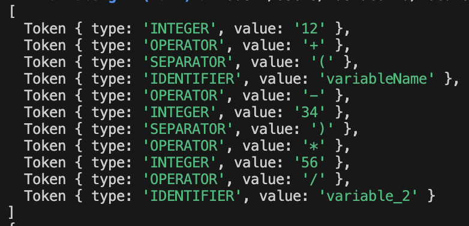
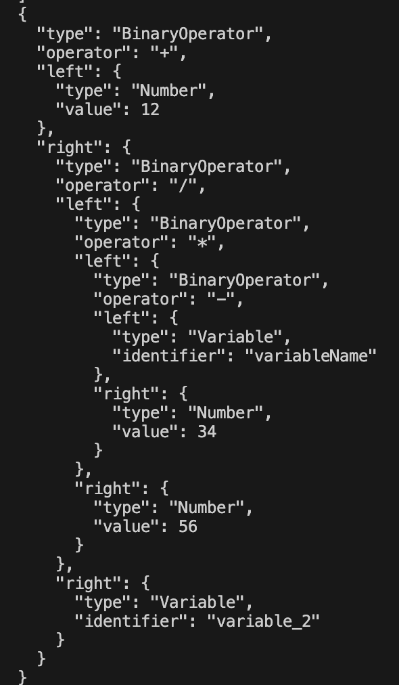

# Parser & Building an Abstract Syntax Tree

### Course: Formal Languages & Finite Automata

### Author: Maria Colța

## Theory

**An abstract syntax tree (AST)** is a data structure used in computer science to represent the structure of a program or code snippet. It is a tree representation of the abstract syntactic structure of text (often source code) written in a formal language. Each node of the tree denotes a construct occurring in the text. It is sometimes called just a syntax tree.

**Parsing, syntax analysis, or syntactic analysis** is the process of analyzing a string of symbols, either in natural language, computer languages or data structures, conforming to the rules of a formal grammar. The term parsing comes from Latin pars (orationis), meaning part (of speech).

The term has slightly different meanings in different branches of linguistics and computer science. Traditional sentence parsing is often performed as a method of understanding the exact meaning of a sentence or word, sometimes with the aid of devices such as sentence diagrams. It usually emphasizes the importance of grammatical divisions such as subject and predicate.

Within computational linguistics the term is used to refer to the formal analysis by a computer of a sentence or other string of words into its constituents, resulting in a parse tree showing their syntactic relation to each other, which may also contain semantic information.[citation needed] Some parsing algorithms generate a parse forest or list of parse trees from a string that is syntactically ambiguous.

## Objectives:

- Get familiar with parsing, what it is and how it can be programmed.
- Get familiar with the concept of AST.
- In addition to what has been done in the 3rd lab work do the following:
  - In case you didn't have a type that denotes the possible types of tokens you need to:
    - Have a type **TokenType** (like an enum) that can be used in the lexical analysis to categorize the tokens.
    - Please use regular expressions to identify the type of the token.
  - Implement the necessary data structures for an AST that could be used for the text you have processed in the 3rd lab work
  - Implement a simple parser program that could extract the syntactic information from the input text.

## Implementation description

Firstly I updated my `Lexer` class to use a `TokenType` enum to categorize tokens.

```
export const TokenType = {
  INTEGER: "INTEGER",
  IDENTIFIER: "IDENTIFIER",
  KEYWORD: "KEYWORD",
  OPERATOR: "OPERATOR",
  SEPARATOR: "SEPARATOR",
  EOF: "EOF",
};
```

Each type of token is defined by other enums:

```
const KEYWORDS = {
  if: TokenType.KEYWORD,
  else: TokenType.KEYWORD,
  function: TokenType.KEYWORD,
  return: TokenType.KEYWORD,
  let: TokenType.KEYWORD,
  true: TokenType.KEYWORD,
  false: TokenType.KEYWORD,
  for: TokenType.KEYWORD,
};

const OPERATOR = {
  "+": TokenType.OPERATOR,
  "-": TokenType.OPERATOR,
  "*": TokenType.OPERATOR,
  "/": TokenType.OPERATOR,
  "%": TokenType.OPERATOR,
  "<": TokenType.OPERATOR,
  ">": TokenType.OPERATOR,
  "==": TokenType.OPERATOR,
  "=": TokenType.OPERATOR,
};

const SEPARATOR = {
  "(": TokenType.SEPARATOR,
  ")": TokenType.SEPARATOR,
  "{": TokenType.SEPARATOR,
  "}": TokenType.SEPARATOR,
  "[": TokenType.SEPARATOR,
  "]": TokenType.SEPARATOR,
  ";": TokenType.SEPARATOR,
  ",": TokenType.SEPARATOR,
};
```

The rest of the `Lexer` class implementation is the same as the previous project.

For construction the AST for parsing expressions, I defined a set of classes for the AST nodes, which represent different types of expressions and statements.

- `ASTNode` - Acts as the base class for all types of nodes in the AST. It provides a common structure for all derived nodes.

The rest of the classes extend the `ASTNode` class:

- `BinaryOperatorNode` - Represents a binary operation in the AST. This node type is used for arithmetic operations (like addition, subtraction, multiplication, division), logical operations, or any other operations that involve two operands.

- `NumberNode` - Represents a numeric literal in the AST. This node is used whenever a numeric value appears directly in the expression (like 42, 3.14, etc.).

- `VariableNode` - Represents a variable identifier in the AST. This node type is used whenever a variable name is encountered in the expression. It allows the variable to be linked to its value elsewhere in the program or expression evaluation context.

Using the above classes, I implemented the `Parser` class, which takes the tokens generated by `Lexer` and constructa an AST. It implementing a simple recursive descent parser that handles binary operations and number literals.

```
class Parser {
  constructor(tokens) {
    this.tokens = tokens;
    this.currentTokenIndex = 0;
  }
}
```

It contains the following methods:

- `consume()` - Consumes the current token and advances to the next one. Returns the current token and increments the `currentTokenIndex` to move to the next token. This method is used to progress through the token array during parsing.

```
  consume() {
    return this.tokens[this.currentTokenIndex++];
  }
```

- `peek()` - Looks at the next token without consuming it. Returns the next token without advancing the token index. This allows the parser to look ahead at the next token for decision-making purposes without altering the current position in the token stream.

```
  peek() {
    if (this.currentTokenIndex < this.tokens.length) {
      return this.tokens[this.currentTokenIndex];
    } else {
      return { type: TokenType.EOF, value: "" };
    }
  }
```

- `parseExpression()` - Begins the expression parsing process. Starts the parsing process at the highest level (addition/subtraction) and returns the parsed AST. It acts as an entry point for parsing expressions.

```
  parseExpression() {
    return this.parseAddition();
  }
```

- `parseAddition()` - Parses addition and subtraction operations. Parses expressions involving addition (+) and subtraction (-), handling operator precedence and associativity by recursive calls to `parseMultiplication`. Constructs a `BinaryOperatorNode` for each operation.

```
  parseAddition() {
    let node = this.parseMultiplication();
    while (this.peek().value === "+" || this.peek().value === "-") {
      const operator = this.consume().value;
      const right = this.parseMultiplication();
      node = new BinaryOperatorNode(operator, node, right);
    }
    return node;
  }
```

- `parseMultiplication()` - Parses multiplication and division operations. Parses expressions involving multiplication (\*) and division (/), similarly handling operator precedence by recursive calls to `parsePrimary`. Constructs a `BinaryOperatorNode` for each operation, linking them as needed based on operator precedence.

```
  parseMultiplication() {
    let node = this.parsePrimary();
    while (this.peek().value === "*" || this.peek().value === "/") {
      const operator = this.consume().value;
      const right = this.parsePrimary();
      node = new BinaryOperatorNode(operator, node, right);
    }
    return node;
  }
```

- `parsePrimary()` - Parses primary expressions such as numbers, variables, and parenthesized expressions. Operates based on the current token. Directly returns a node based on the type of the current token:
  - For numbers - a `NumberNode`.
  - For identifiers (variables), - a `VariableNode`.
  - For parentheses, it recursively parses the expression inside the parentheses, ensuring correct handling of expression grouping and operator precedence.

```
  parsePrimary() {
    const token = this.consume();
    if (token.type === TokenType.SEPARATOR && token.value === "(") {
      const expr = this.parseExpression();
      const expectedCloseParen = this.consume();
      if (
        expectedCloseParen.type !== TokenType.SEPARATOR ||
        expectedCloseParen.value !== ")"
      ) {
        throw new Error("Expected ')'");
      }
      return expr;
    } else if (token.type === TokenType.INTEGER) {
      return new NumberNode(token.value);
    } else if (token.type === TokenType.IDENTIFIER) {
      return new VariableNode(token.value);
    } else {
      throw new Error(`Unexpected token type: ${token.type}`);
    }
```

## Results

To test the results, I ran the following code:

```
const input = "12 + (variableName - 34) * 56 / variable_2";

const lexer = new Lexer(input);
const tokens = lexer.tokenize();

console.log(tokens);

const parser = new Parser(tokens);
const ast = parser.parseExpression();

console.log(JSON.stringify(ast, null, 2));

```

And got the next output:



This is an array of tokens which are present in the input source string.



This is the AST in a JSON format

## Conclusions

In conclusion, I managed to understand the concepts of parsing, what it is and how it can be programmed, as well as the concept of AST. I used that knowledge to implement that in code.

I created a parser that takes a series tokens generated by lexer. My parser effectively identifies and handles mathematical operations, variable names, and groups of operations enclosed in parentheses. It is carefully designed to handle the order of operations correctly, making sure that calculations are done in the right sequence according to standard math rules.

## References

[Parsing](https://en.wikipedia.org/wiki/Parsing)

[AST](https://en.wikipedia.org/wiki/Abstract_syntax_tree)
