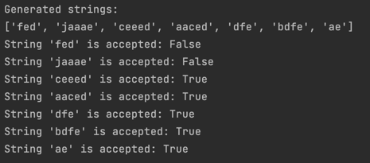

# Intro to formal languages. Regular grammars. Finite Automata.

### Course: Formal Languages & Finite Automata
### Author: Maria Colța

----

## Theory
A formal language is considered to be a format used to transmit information from a sender to the one that recieves it. The usual components of a language are:
* The alphabet: Set of valid characters;
* The vocabulary: Set of valid words;
* The grammar: Set of rules over the language.

Finite automata theory focuses on algorithms for processing symbol strings and their set membership, defined by automaton rules. Key points include:
* Finite Set of States: Includes start states and accept states;
* Transitions: Triggered by input symbols between states;
* Types: Deterministic (DFA) and Nondeterministic (NFA):
  * DFA: One state at a time, each input leads to one next state;
  * NFA: Muultiple states at once, multiple next states possible;
* Applications: Pattern matching, lexical analysis, network protocols.

## Objectives:

* Discover what a language is and what it needs to have in order to be considered a formal one.
* Provide the initial setup for the evolving project that I will work on during this semester.
* According to the grammar definition:
  *  Implement a type/class for the grammar;
  *  Generate 5 valid strings from the language expressed by the given grammar;
  *  Implement some functionality that would convert and object of type Grammar to one of type Finite Automaton;
  *  For the Finite Automaton, add a method to check if the input string can be obtained via the state transition from it.


## Implementation description

For these tasks, I was given the following grammar:
```
Variant 4:
VN={S, L, D}, 
VT={a, b, c, d, e, f, j},
P={ 
    S → aS
    S → bS
    S → cD
    S → dL
    S → e
    L → eL
    L → fL
    L → jD
    L → e
    D → eD
    D → d
}
```
I implemented two classes: `Grammar` and `Finite Automaton`. 

The given grammar was encapsulated within the Grammar class, which is responsible for generating strings that belong to the language defined by the grammar. The generation process relies on recursively expanding non-terminal symbols based on the production rules until a string consisting solely of terminal symbols is produced.

```
class Grammar:
    def __init__(self):
        self.V_n = {'S', 'L', 'D'}
        self.V_t = {'a', 'b', 'c', 'd', 'e', 'f', 'j'}
        self.P = {
            'S': [['a', 'S'], ['b', 'S'], ['c', 'D'], ['d', 'L'], ['e']],
            'L': [['e', 'L'], ['f', 'L'], ['j', 'D'], ['e']],
            'D': [['e', 'D'], ['d']]
        }
        self.S = 'S'

    def generate_string(self):
        def expand(symbol):
            if symbol in self.V_t:
                return symbol
            productions = self.P[symbol]
            chosen_production = random.choice(productions)
            return ''.join(expand(sym) for sym in chosen_production)
        return expand(self.S)

    def to_finite_automaton(self):
        fa = FiniteAutomaton.FiniteAutomaton()

        return fa
```

 `FiniteAutomaton` class was implemented to simulate a finite automaton that can recognize a subset of the language described by the grammar. The FA is defined by its states, alphabet, transition functions, start state, and accept states.

```
class FiniteAutomaton:
    def __init__(self):
        self.states = {'S', 'L', 'D', 'end'}
        self.alphabet = {'a', 'b', 'c', 'd', 'e', 'f', 'j'}
        self.transitions = {
            ('S', 'a'): {"S"},
            ('S', 'b'): {"S"},
            ('S', 'c'): {"D"},
            ('S', 'd'): {"L"},
            ('D', 'e'): {"D"},
            ('D', 'd'): {"end"},
            ('L', 'e'): {"L", "end"},
            ('L', 'f'): {"L"},
            ('L', 'j'): {"D"},
            ('S', 'e'): {"end"},
        }
        self.start_state = 'S'
        self.accept_states = {'end'}

    def accepts(self, input_string):
        current_states = {self.start_state}
        for char in input_string:
            next_states = set()
            for state in current_states:
                transition_key = (state, char)
                if transition_key in self.transitions:
                    next_states.update(self.transitions[transition_key])
            current_states = next_states

        return bool(current_states & self.accept_states)
```
The `accepts` method within this class checks whether a given string is recognized by the automaton by simulating state transitions based on the input string and determining if the automaton can end in an accept state.

## Results
After running the code, we get the following result:

The first two strings were hardcoded to test that the Automaton doesn't accept the string if it doesn't follow the rules :).

