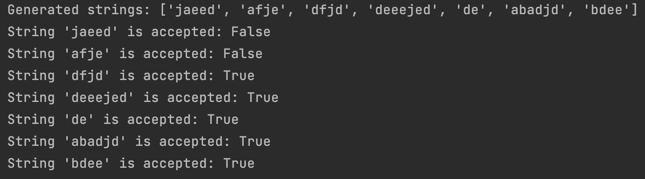

# Intro to formal languages. Regular grammars. Finite Automata.

### Course: Formal Languages & Finite Automata
### Author: Maria Colța

----

## Theory
A **formal language** is considered to be a format used to transmit information from a sender to the one that recieves it. The usual components of a language are:
* The alphabet: Set of valid characters;
* The vocabulary: Set of valid words;
* The grammar: Set of rules over the language.

A **regular grammar** is a specific type of formal grammar that generates regular language. Usually a grammar is defined by:
* V_t: A finite set of terminal symbols
* V_n: A finite set of non-terminal symbols
* S: Start symbol
* P: Finite set of production rules

The language generated by a grammar represents the set of all strings of terminals that are derivable from the start symbol S.

**Finite automata** theory focuses on algorithms for processing symbol strings and their set membership, defined by automaton rules. Key points include:
* Finite Set of States: Includes start states and accept states;
* Transitions: Triggered by input symbols between states;
* Types: Deterministic (DFA) and Nondeterministic (NFA):
  * DFA: One state at a time, each input leads to one next state;
  * NFA: Multiple states at once, multiple next states possible;
* Applications: Pattern matching, lexical analysis, network protocols.

## Objectives:

* Discover what a language is and what it needs to have in order to be considered a formal one.
* Provide the initial setup for the evolving project that I will work on during this semester.
* According to the grammar definition:
  *  Implement a type/class for the grammar;
  *  Generate 5 valid strings from the language expressed by the given grammar;
  *  Implement some functionality that would convert and object of type Grammar to one of type Finite Automaton;
  *  For the Finite Automaton, add a method to check if the input string can be obtained via the state transition from it.


## Implementation description

For these tasks, I was given the following grammar:
```
Variant 4:
VN={S, L, D}, 
VT={a, b, c, d, e, f, j},
P={ 
    S → aS
    S → bS
    S → cD
    S → dL
    S → e
    L → eL
    L → fL
    L → jD
    L → e
    D → eD
    D → d
}
```
I implemented two classes: `Grammar` and `Finite Automaton`. 

The given grammar was encapsulated within the `Grammar` class, which is responsible for generating strings that belong to the language defined by the grammar, and converting an object of type Grammar to one of type `FiniteAutomaton`. I declared the terminal and non-terminal symbols, as well as the rules for the production rules and the start symbol.
```
class Grammar:
    def __init__(self):
        self.V_t = ["a", "b", "c", "d", "e", "f", "j"]
        self.V_n = ["S", "L", "D"]
        self.P = ["S-aS", "S-bS", "S-cD", "S-dL",
                  "S-e", "L-eL", "L-fL", "L-jD", "L-e", "D-eD", "D-d"]
        self.S = "S"
```
Next I implemented the `generate_string` method:
```
def generate_string(self):
    def expand(symbol):
        if symbol in self.V_t:
            return symbol
        productions = [p.split("-")[1] for p in self.P if p.startswith(symbol + "-")]
        chosen_production = random.choice(productions)
        return ''.join(expand(s) for s in chosen_production)

    return expand(self.S)
```


It creates a string according to the rules of a grammar by starting with a basic symbol and expanding it step by step. If the symbol is terminal and doesn't need further breaking down, it's added to the string directly. If the symbol can be expanded, the method randomly selects one of the grammar's rules to do so, breaking the symbol into smaller parts. This process repeats recursively.

Also in the `Grammar` class I defined the `to_finite_automaton` method, which converts an object of type Grammar to one of type FiniteAutomaton:
```
def to_finite_automaton(self):
    alphabet = list(self.V_t)
    states = list(self.V_n)
    states.append("end")
    start_state = self.S
    accept_state = "end"

    transitions = []
    for production in self.P:
        parts = production.split("-")
        left_side = parts[0]
        right_side = parts[1]

        if len(right_side) == 1 and right_side in self.V_t:
            transitions.append({'src': left_side, 'char': right_side, 'dest': accept_state})
        elif len(right_side) > 1:
            transitions.append({'src': left_side, 'char': right_side[0], 'dest': right_side[1]})

    return FiniteAutomaton(states, alphabet, transitions, start_state, accept_state)
```
The `to_finite_automaton` method transforms a context-free grammar into a finite automaton by creating states from non-terminal symbols and an "end" state, and defining transitions based on the grammar's production rules. It interprets each production rule to either transition to an "end" state if the rule produces a terminal symbol, or move between states based on the first character of the rule's output, thus constructing a simplified automaton representation of the grammar.

Next I implemented the `FiniteAutomaton` class:
```
class FiniteAutomaton:
    def __init__(self, states, alphabet, transitions, start_state, accept_states):
        self.states = states
        self.alphabet = alphabet
        self.transitions = transitions
        self.start_state = start_state
        self.accept_states = accept_states
```
It encapsulates the behaviour and structure of a finite automaton: states, alphabet, transitions, the initial and final state.

In this class, I implemented the `accept` method, which checks whether a given string is recognized by the automaton by simulating state transitions based on the input string and determining if the automaton can end in an accept state.
It uses the `find_transitions` method to retrieve all the transitions available from a given `current_state` for a given `input_symbol`.
```
def accept(self, input_string):
    current_states = {self.start_state}
    for char in input_string:
        input_symbol = str(char)
        next_states = set()
        for current_state in current_states:
            transitions = self.find_transitions(current_state, input_symbol)
            for transition in transitions:
                next_states.add(transition['dest'])
        if not next_states:
            return False
        current_states = next_states
    for current_state in current_states:
        if current_state in self.accept_states:
            return True

    return False

def find_transitions(self, current_state, input_symbol):
    result = []
    for transition in self.transitions:
        if transition['src'] == current_state and transition['char'] == input_symbol:
            result.append(transition)
    return result
```

## Results
After running the code, we get the following result:


The first two strings were hardcoded to test that the Automaton doesn't accept the string if it doesn't follow the rules :).

